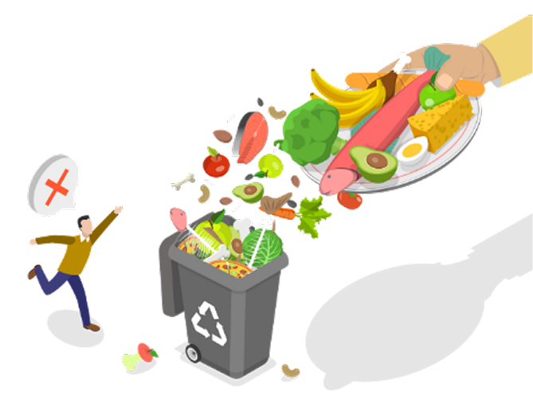

<div align="center">
  
  <h1 align="center">Safe Bite</h1>
  <p align="center">
    <b>Your Smart Food Inventory & Recipe Companion</b>
  </p>

  <p align="center">
    <a href="https://flutter.dev/">
      
    </a>
    <a href="https://dart.dev/">
      
    </a>
    <a href="https://firebase.google.com/">
      
    </a>
    <a href="https://ai.google.dev/">
      
    </a>
    <a href="https://bloclibrary.dev/">
      
    </a>
  </p>
</div>

---

## 📋 Overview

**Safe Bite** is a cutting-edge mobile application built with Flutter that transforms how you manage your kitchen. By leveraging the power of **Google Generative AI**, Safe Bite helps you track food expiry dates, reduce waste, and discover delicious recipes based on the ingredients you already have.

Whether you're looking to organize your pantry, monitor your food consumption habits, or simply find inspiration for your next meal, Safe Bite has you covered.

## ✨ Key Features

- **📸 Smart Scanning**: Quickly add food items to your inventory using your camera. Integrated with **ML Kit** for object detection to recognize items automatically.
- **⏳ Expiration Tracking**: Never let food go to waste again. detailed lists of your items sorted by expiration date, with visual indicators for expiring soon items.
- **🍳 AI-Powered Recipes**: Stuck on what to cook? Safe Bite uses **Google Gemini AI** to suggest creative recipes based specifically on your available stock.
- **📊 Insightful Statistics**: Visualize your consumption patterns and waste reduction progress with beautiful interactive charts.
- **🔐 Secure Cloud Sync**: Your data is safe and accessible across devices, powered by **Firebase Authentication** and **Cloud Firestore**.

## 🛠️ Tech Stack

- **Framework**: [Flutter](https://flutter.dev/)
- **State Management**: [Bloc / Cubit](https://pub.dev/packages/flutter_bloc)
- **Backend Services**: [Firebase](https://firebase.google.com/) (Auth, Firestore, Storage)
- **Artificial Intelligence**: 
  [Google Generative AI (Gemini)](https://pub.dev/packages/google_generative_ai)
- **Charts**: [fl_chart](https://pub.dev/packages/fl_chart)
- **Networking**: [Dio](https://pub.dev/packages/dio)

## 🚀 Getting Started

Follow these steps to get a local copy up and running.

### Prerequisites

- [Flutter SDK](https://docs.flutter.dev/get-started/install) installed on your machine.
- A Firebase project set up for this application.

### Installation

1.  **Clone the repository**
    ```bash
    git clone https://github.com/yourusername/safe_bite.git
    cd safe_bite
    ```

2.  **Install dependencies**
    ```bash
    flutter pub get
    ```

3.  **Environment Configuration**
    Create a `.env` file in the root directory and add your API keys (e.g., Gemini API Key).
    ```env
    GEMINI_API_KEY=your_api_key_here
    ```

4.  **Run the App**
    ```bash
    flutter run
    ```

## 📸 Screenshots

*(Add your screenshots here)*

| Home | Scanner | Stats | Recipes |
|:---:|:---:|:---:|:---:|
|  | *(Add Screen)* | *(Add Screen)* |  |

## 👥 Contributors

This project exists thanks to all the people who contribute.

<div align="center">
  <a href="https://github.com/FaizNation">
    
  </a>
    <a href="https://github.com/IzoraElverda">
    
  </a>
  <a href="https://github.com/suryahadipurnamasurya">
    
  </a>
  <a href="https://github.com/leeviray">
    
  </a>
</div>


---

<p align="center">
  Built with ❤️ using Flutter
</p>
